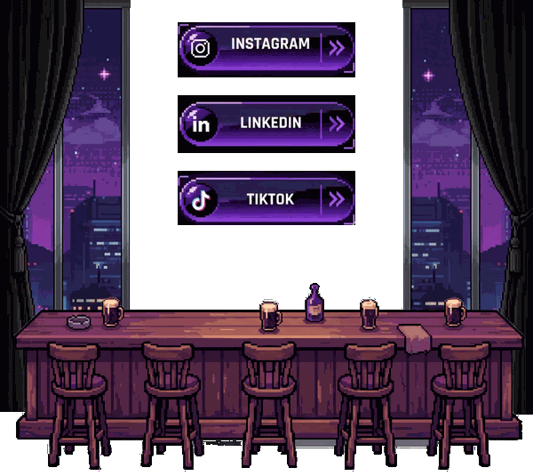

<h1 align="center">Hi 👋, I'm IVANDHIEM AL KHOWWAASH</h1>
<div align="center">
  
</div>

<div align="center">
	
	<br>
	<br>
</div>


<div align="center">
      
      
      
      <a href="https://discord.com/users/725714272210124823"></a>
</div>

## 🖐️ About Me


- My full name is **Ivandhiem al Khowwaash** 
- My major is **Full-stack Development**
- Primary Focus: **Google Cloud Platform (GCP)**—designing scalable and secure architectures.
- I'm interested in coding, sleeping, and watching film
- 🌐 Portfolio: [www.niteshjatin.me](https://www.niteshjatin.me/)

<br clear="both"/>

```text
ivandhiem@github:~$ echo $QUOTE
> "It's never too late - never too late to start over, never too late to be happy"
```


### 🚀 Hobby Projects

| Preview | Project Name | Description | Link |
| :---: | :--- | :--- | :--- |

### 💼 Freelancing Projects

| Preview | Project Name | Description | Link |
| :---: | :--- | :--- | :--- |

### 📚 Learning Projects

| Project Name | Description | Link |
| :--- | :--- | :--- |


## 🤝 Contribute to India College Data Project

<p align="center">
  <a href="https://didactic-pancake-5yz9.onrender.com/">
    
  </a>
  <a href="https://github.com/IVANNNGG/didactic-pancake">
    
  </a>
  <a href="https://github.com/IVANNNGG/didactic-pancake/issues">
    
  </a>
  <a href="https://github.com/IVANNNGG/didactic-pancake/fork">
    
  </a>
</p>

**Our Goal:** Build a comprehensive, open-source directory of contact details (mobile number, email, website) for every college in India — making it easier for students, researchers, and educators to connect.

**How you can help:**
- ⭐ Star the repo to show support
- 🍴 Fork and add/update college data
- 🐛 Report issues or suggest improvements
- 📢 Share with others who might contribute

> ⚠️ **Warning:** This project is intended for educational and legitimate communication purposes only. **Spamming, unsolicited marketing, or misuse of this data is strictly prohibited.** Use responsibly.

[](https://github.com/IVANNNGG/didactic-pancake)

[](https://www.linkedin.com/in/nitesh-chourasiya-a66715292/)
[](https://www.youtube.com/@justincodes)
[](https://x.com/JatinTurbo)
[](https://www.instagram.com/aalooo_ke_pakode)
[](https://wa.me/918602074069)
[](https://discord.com/users/725714272210124823)
[](mailto:chaurasiyanitesh68@gmail.com)
[](https://leetcode.com/u/chaurasiyanitesh/)
[](https://gravatar.com/left82b51f829fb)

[](https://app.docker.com/accounts/chaurasiyajatin68/settings/account-information)


## 🛠️ Tech Stack & Tools

               
##
<picture>
  <source media="(prefers-color-scheme: dark)" srcset="https://raw.githubusercontent.com/IVANNNGG/IVANNNGG/output/pacman-contribution-graph-dark.svg">
  <source media="(prefers-color-scheme: light)" srcset="https://raw.githubusercontent.com/IVANNNGG/IVANNNGG/output/pacman-contribution-graph.svg">
  
</picture>

##
> 💬 _Always open to meaningful conversations, tech collaboration, and exploring new ideas in cloud computing.._


<p></p>


<br>
<br>

<div align="center">
  
</div>
<br clear="both"/>


